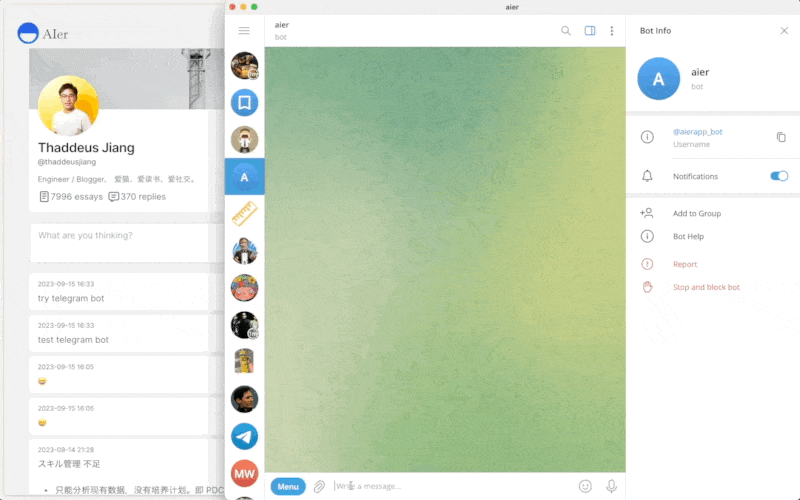

# AierBot

A telegram bot to sync messages to https://aier.app



## Build with

- [Elixir](https://elixir-lang.org/)
- [ex_gram](https://github.com/rockneurotiko/ex_gram)

## Usage

TODO:

## Development

```sh
mix deps.get

export TELEGRAM_BOT_TOKEN=
export AIER_API_TOKEN=
export OPENAI_API_KEY=

mix run --no-halt
```

## Deployment

### CI/CD

GitHub Actions

Secrets:

- `TELEGRAM_BOT_TOKEN`
- `AIER_API_TOKEN`
- `FLY_API_TOKEN`
